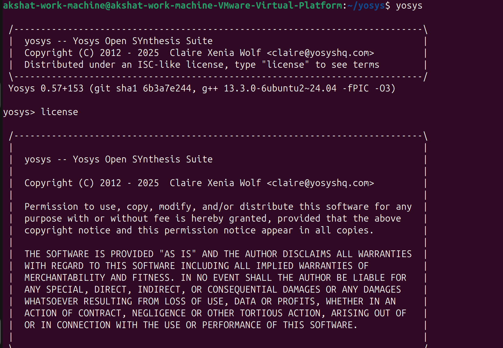
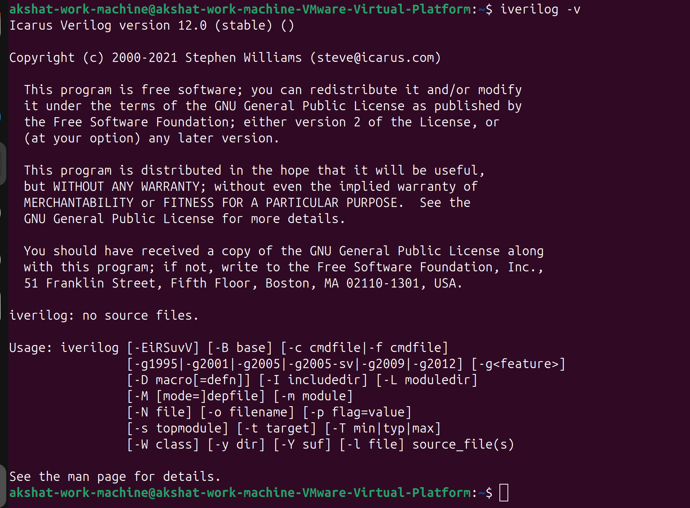

# 🗓️ Week 0: Environment Setup & Tool Installation

[← Back to Main Page](../README.md)

<p align="center">
  
  
  
  
</p>

> 🚀 **Goal**: Set up a high-performance, open-source EDA toolchain for the “Concept to Silicon” VLSI journey — from RTL to GDSII.

---

## 🖥️ System Configuration

A robust environment is essential for smooth VLSI design workflows. Below is a comparison between the **recommended setup** and my **custom high-performance configuration**.

### 📋 Suggested Configuration
> *Baseline specs as per program guidelines.*

| Component       | Specification             |
|-----------------|---------------------------|
| **Virtualization** | Oracle VirtualBox         |
| **OS**          | Ubuntu 20.04+             |
| **RAM**         | 6 GB                      |
| **Storage**     | 50 GB HDD                 |
| **vCPUs**       | 4                         |

---

### ⚡ My Custom High-Performance Setup

> *Optimized for speed, responsiveness, and future scalability.*

| Component       | Specification             |
|-----------------|---------------------------|
| **Virtualization** | VMware Workstation        |
| **OS**          | Ubuntu 22.04 LTS          |
| **RAM**         | 8 GB                      |
| **Storage**     | 80 GB (External SSD)      |
| **vCPUs**       | 8 (2 CPUs × 4 Cores)      |

✅ **Why this setup?** Faster I/O, smoother simulations, and no lag during layout or synthesis.

---

## 🛠️ Tool Installation & Verification

All tools were installed in sequence. Each section includes **installation commands** and a placeholder for **verification screenshots** (add your own later).

---

<details>
<summary>🔹 1. Yosys — RTL Synthesis Framework</summary>

> 🧩 Converts Verilog to gate-level netlists.

```bash
sudo apt-get update
git clone https://github.com/YosysHQ/yosys.git
cd yosys
sudo apt install make
sudo apt-get install build-essential clang bison flex libreadline-dev gawk tcl-dev libffi-dev git graphviz xdot pkg-config python3 libboost-system-dev libboost-python-dev libboost-filesystem-dev zlib1g-dev
make config-gcc
make
sudo make install
```

📸 **Verification Snapshot**: 


</details>

---

<details>
<summary>🔹 2. Icarus Verilog (iverilog) — Simulation Tool</summary>

> 🧪 Compiles and simulates Verilog designs.

```bash
sudo apt-get update
sudo apt-get install iverilog
```

📸 **Verification Snapshot**:  


</details>

---

<details>
<summary>🔹 3. GTKWave — Waveform Viewer</summary>

> 📈 Visualizes simulation results (VCD files).

```bash
sudo apt-get update
sudo apt install gtkwave
```

📸 **Verification Snapshot**:  
*(Insert screenshot of GTKWave opening a sample .vcd file)*

</details>

---

<details>
<summary>🔹 4. ngspice — Circuit Simulator</summary>

> 🔌 Simulates analog and mixed-signal circuits.

```bash
# Download from: https://sourceforge.net/projects/ngspice/files/ng-spice-rework/37/
tar -zxvf ngspice-37.tar.gz
cd ngspice-37
mkdir release
cd release
../configure --with-x --with-readline=yes --disable-debug
make
sudo make install
```

📸 **Verification Snapshot**:  
*(Insert screenshot of `ngspice` launching successfully)*

</details>

---

<details>
<summary>🔹 5. Magic — VLSI Layout Editor & DRC</summary>

> 🎨 Create, edit, and verify physical layouts.

```bash
# Install dependencies
sudo apt-get install m4 tcsh csh libx11-dev tcl-dev tk-dev libcairo2-dev mesa-common-dev libglu1-mesa-dev libncurses-dev

# Clone and build
git clone https://github.com/RTimothyEdwards/magic.git
cd magic
./configure
make
sudo make install
```

📸 **Verification Snapshot**:  
*(Insert screenshot of Magic GUI launching or DRC run)*

</details>

---

<details>
<summary>🔹 6. OpenLane — Automated RTL-to-GDSII Flow</summary>

> 🤖 End-to-end flow integrating Yosys, Magic, and more.

```bash
# Update system
sudo apt-get update && sudo apt-get upgrade -y

# Install core dependencies
sudo apt install -y build-essential python3 python3-venv python3-pip make git

# Install Docker
sudo apt install apt-transport-https ca-certificates curl software-properties-common -y
curl -fsSL https://download.docker.com/linux/ubuntu/gpg | sudo gpg --dearmor -o /usr/share/keyrings/docker-archive-keyring.gpg
echo "deb [arch=amd64 signed-by=/usr/share/keyrings/docker-archive-keyring.gpg] https://download.docker.com/linux/ubuntu $(lsb_release -cs) stable" | sudo tee /etc/apt/sources.list.d/docker.list > /dev/null
sudo apt update
sudo apt install docker-ce docker-ce-cli containerd.io -y
sudo groupadd docker
sudo usermod -aG docker $USER
sudo reboot  # Reboot to apply Docker permissions

# Install OpenLane
git clone https://github.com/The-OpenROAD-Project/OpenLane.git
cd OpenLane
make
make test
```

📸 **Verification Snapshot**:  
*(Insert screenshot of successful `make test` or first PDK build)*

</details>

---

## ✅ Installation Summary

| Tool         | Status     | Primary Use               |
|--------------|------------|---------------------------|
| **Yosys**    | ✅ Installed | RTL Synthesis             |
| **Iverilog** | ✅ Installed | Functional Simulation     |
| **GTKWave**  | ✅ Installed | Waveform Visualization    |
| **ngspice**  | ✅ Installed | Circuit Simulation        |
| **Magic**    | ✅ Installed | Layout & DRC              |
| **OpenLane** | ✅ Installed | Automated GDSII Flow      |

---

## 🎯 Next Steps

✅ **Environment is fully configured and battle-tested.**  
🔜 Ready for **Week 1: Combinational Logic Design & Simulation**.

---
